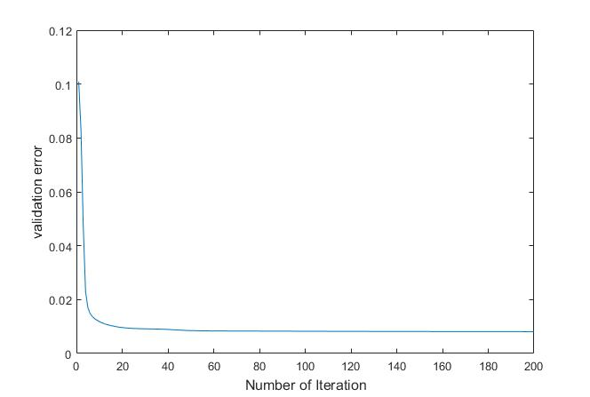
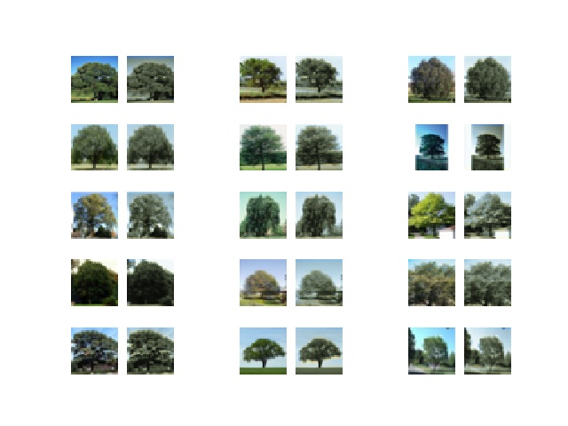

# Image Colorization

A neural network-based approach to colorize grayscale images, implemented from scratch in Python without GPU acceleration.

## Overview

This project implements a colorization model that maps grayscale images to their color counterparts. The model uses a neural network architecture built from scratch to learn the mapping from pixel neighborhoods (context windows) to RGB color vectors.

## Approach

### Problem Representation

Since a single grayscale value contains limited information, the model maps the **context** of a pixel (a group of neighboring pixels) to a single $(r, g, b)$ color vector. The intuition is that pixels that are close and have similar grayscale values tend to have similar color vectors.

- **Input**: A context window of neighboring pixels (e.g., window size 2 creates a 25-pixel neighborhood: $(2 \times 2 + 1)^2 = 25$)
- **Output**: RGB color vector $(r, g, b)$ for the center pixel
- **Padding**: Used to handle edge cases where center pixels are near image borders

### Model Verification

The implementation includes correctness verification:

1. **Gradient Checking**: Numerical gradients are compared with backpropagation gradients. The ratio of $L^2$ norm differences is consistently smaller than $1e-11$:

$$
r_{L^2} = \frac{||G^{numerical} - G^{back-propagation}||}{||G^{numerical} + G^{back-propagation}||} < 1e-11
$$

2. **XOR Problem Test**: The network was tested on the XOR problem with architecture [2, 2, 1], converging in several thousand iterations with testing error smaller than $1e-6$.

## Data

- **Dataset**: CIFAR-100 [[1]](#references)
- **Subset**: One class (trees, class ID 52) containing 600 32×32 color images
- **Split**:
  - Training: 400 images
  - Validation: 100 images
  - Testing: 100 images

### Preprocessing

1. Images are normalized to have RGB values in $[0, 1]$
2. Grayscale conversion is applied to create input data
3. For each pixel, a context window array is created (e.g., length 25 for window size 2)
4. Total training data points: $400 \times 32 \times 32 = 409,600$

## Model Architecture

- **Input Dimension**: 

$$
(2 \times \text{window size} + 1)^2
$$

- **Hidden Layers**: [8, 4] neurons
- **Output Dimension**: 3 (RGB channels)
- **Activation**: Sigmoid
- **Regularization**: L2 regularization with $\lambda = 0.0001$

## Training

### Optimization

- **Algorithm**: Stochastic Gradient Descent (SGD) with Adam optimizer [[2]](#references)
- **Adam Parameters** (as recommended by original authors):
  - Learning rate $\alpha = 0.001$
  - $\beta_1 = 0.9$
  - $\beta_2 = 0.999$
  - $\varepsilon = 1e-8$
- **Regularization Rate**: $\lambda = 0.0001$
- **Batch Size**: 1024

### Training Strategy

1. Training continues until validation error stops improving for 10 epochs
2. The optimization process is repeated 6 times, each time with an order of magnitude smaller learning rate
3. Model converges after approximately 200 epochs



*Validation error decreases rapidly at the beginning and then stabilizes at a low value, indicating successful convergence.*

### Cost Function

Mean Squared Error with L2 regularization:

$$
J = \frac{1}{2m} \sum_{i=1}^{m} \sum_{c} (y^{(i,c)} - t^{(i,c)})^2 + \frac{\lambda}{2m} \sum_{i,j} (w^{i,j})^2
$$

where:
- $y^{(i,c)}$ is the predicted value of $i$-th pixel and channel $c$
- $t^{(i,c)}$ is the target value
- $m$ is the batch size
- $\lambda$ is the regularization rate
- $w^{i,j}$ represents all weights

## Evaluation

The model is evaluated using:

1. **Numerical Error**: Mean Squared Error on pixel level for each color channel
2. **Visual Assessment**: Comparison of predicted vs. original color images

### Results



*Comparison of original color images (left) and predicted colorized images (right) on the test set.*

The model demonstrates:
- ✅ Good differentiation between trees, sky, ground, and buildings
- ✅ Correct overall shape/segmentation even when exact colors differ
- ⚠️ Some color inaccuracies (e.g., pale tree colors instead of green) due to nearby white buildings influencing predictions
- ⚠️ Limited generalization: trained only on tree images, struggles with other object classes (ships, dogs, etc.)

## Usage

### Prerequisites

```bash
pip install numpy tensorflow scikit-image matplotlib scipy
```

### Running the Model

1. **Test Correctness** (XOR problem and gradient checking):
   ```bash
   python src/main_test.py
   ```

2. **Train the Model**:
   ```bash
   python src/main.py
   ```
   This will train the model from scratch and save weights to `src/_weights_`.

3. **Test with Pre-trained Weights**:
   ```bash
   python src/main.py -w src/weights
   ```
   This loads the specified pre-trained weights file and tests the model (skips training).

### Project Structure

```
image-colorization/
├── src/
│   ├── main.py          # Main training and testing script
│   ├── neuralnet.py     # Neural network implementation
│   ├── dataset.py       # Dataset handling
│   ├── loader.py        # CIFAR-100 data loading and preprocessing
│   ├── trainer.py       # Training logic with Adam optimizer
│   ├── utils.py         # Utility functions
│   ├── _weights_        # Saved model weights
│   └── _validation_errors_  # Validation error history
├── images/              # Result images
└── README.md
```

## Limitations & Future Improvements

### Current Limitations

1. **Limited Dataset**: Trained only on tree images from CIFAR-100
2. **No GPU Acceleration**: CPU-only implementation
3. **Simple Architecture**: Shallow network without modern techniques

### Proposed Improvements

1. **Scale Up**:
   - Build GPU version
   - Train on full CIFAR-100 dataset
   - Use larger, deeper networks

2. **Advanced Techniques**:
   - Batch normalization
   - Dropout regularization
   - Convolutional Neural Networks (CNNs)
   - Better normalization mechanisms

3. **Evaluation**:
   - Implement "Colorization Turing Test" for perceptual error assessment

## References

1. [CIFAR-100 Dataset](https://www.cs.toronto.edu/~kriz/cifar.html)
2. Kingma, D. P., & Ba, J. (2014). Adam: A method for stochastic optimization. *CoRR*, abs/1412.6980.